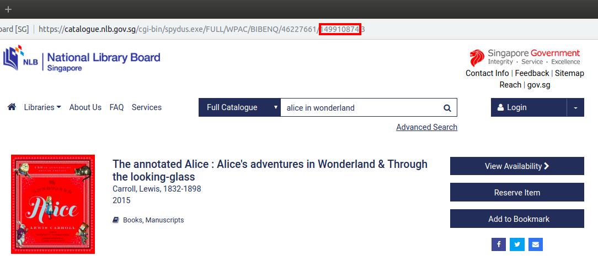

This library queries book information from NLB.

## Installation

`npm install ...`

## Usage

Two operations are supported, `getTitleDetails` and `getAvailabilityInfo`.

`getTitleDetails(bid)`: given a book id, return its title details in this format:

``` javascript
{ titleName: ..., author: ... }
```

`getAvailabilityInfo(bid)`: given a book id, return its availabilities in this format:

``` javascript
[ { branchName: ..., shelfLocation: ..., callNumber: ..., statusDesc: ... }, ... ]
```

The book id `bid` can be found from the URL of the catalogue's book page:



## Dependencies

`axios` is used for HTTP requests, and `cheerio` for parsing HTML DOM.
